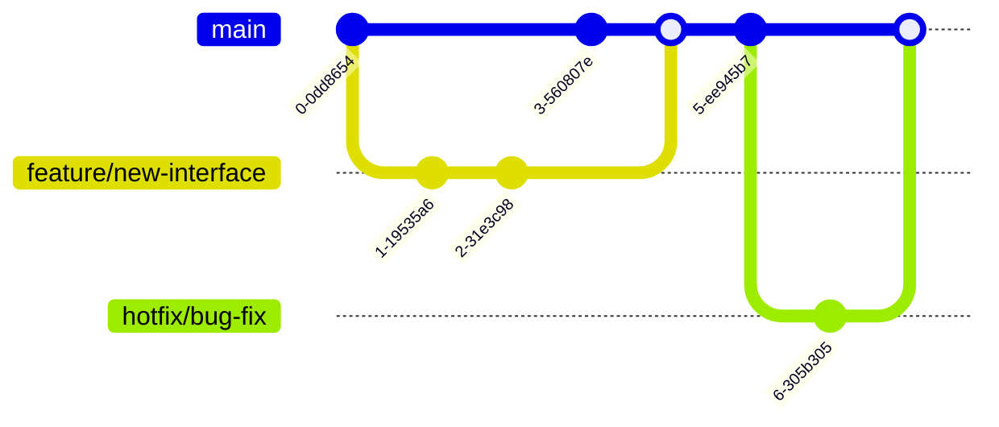

# Mermaid Guide for ScarySingleDocs Documentation

This guide explains how to use Mermaid syntax to create various diagrams for documenting the ScarySingleDocs project. Mermaid is a simple markdown-like syntax for generating diagrams and flowcharts.

## What is Mermaid?

Mermaid is a JavaScript-based diagramming and charting tool that uses Markdown-inspired text definitions to create and modify diagrams dynamically. It's perfect for documentation because:
- It's text-based and version control friendly
- It integrates seamlessly with markdown
- It supports a wide variety of diagram types
- It's easy to learn and use

## Basic Syntax

Mermaid diagrams are enclosed in triple backticks with the `mermaid` identifier:


## Supported Diagram Types

### 1. Flowcharts

Flowcharts are perfect for showing processes, workflows, and decision trees.

#### Basic Flowchart


#### Flowchart with Subgraphs


### 2. Sequence Diagrams

Sequence diagrams show how objects interact in a particular scenario.

#### Basic Sequence Diagram


#### Complex Sequence with Loops


### 3. Class Diagrams

Class diagrams are perfect for showing software architecture and object-oriented design.

#### Basic Class Diagram


#### Advanced Class Diagram


### 4. State Diagrams

State diagrams show the state transitions of a system or component.

#### Basic State Diagram


#### Complex State Diagram


### 5. Entity Relationship Diagrams (ERD)

ERDs are perfect for showing database relationships.

#### Basic ERD


### 6. User Journey Maps

User journey maps show the user's experience through a system.

#### User Journey for Model Selection


### 7. Git Graphs

Git graphs show branching and merging in version control.

#### Git Workflow


### 8. Timeline Diagrams

Timeline diagrams show events over time.

#### Project Timeline


### 9. Pie Charts

Pie charts show data distribution.

#### Model Type Distribution


### 10. Quadrant Charts

Quadrant charts are useful for prioritization and analysis.

#### Feature Prioritization
```mermaid
quadrantChart
    title Feature Prioritization Matrix
    x-axis Low Cost --> High Cost
    y-axis Low Value --> High Value
    quadrant-1 High Priority: Do it now
    quadrant-2 Strategic: Plan for future
    quadrant-3 Low Priority: Maybe later
    quadrant-4 Reconsider: Avoid if possible
    
    "Tabbed Interface": [0.8, 0.9]
    "Dark Mode": [0.3, 0.7]
    "Advanced Search": [0.7, 0.6]
    "Mobile App": [0.9, 0.4]
```

## Best Practices for ScarySingleDocs Documentation

### 1. Consistency
- Use consistent styling across all diagrams
- Follow a naming convention for nodes and connections
- Maintain consistent direction (top-to-bottom or left-to-right)

### 2. Clarity
- Keep diagrams simple and focused
- Use descriptive names for nodes
- Add comments or notes when necessary
- Break complex diagrams into smaller, focused diagrams

### 3. Documentation Structure


### 4. Example: Complete ScarySingleDocs System Architecture


## Integration with Markdown

Mermaid diagrams integrate seamlessly with markdown files:

```markdown
# ScarySingleDocs Architecture

## System Overview

The ScarySingleDocs system consists of several interconnected components:


## User Flow

Here's how users interact with the system:


```

## Tools and Editors

### Online Editors
- **Mermaid Live Editor**: https://mermaid.live
- **Mermaid-js GitHub**: https://github.com/mermaid-js/mermaid

### VS Code Integration
- Install the "Markdown Preview Mermaid Support" extension
- Use "Markdown All in One" for enhanced markdown support

### Documentation Platforms
- **GitHub**: Supports Mermaid natively in markdown files
- **GitLab**: Built-in Mermaid support
- **Notion**: Supports Mermaid via code blocks
- **Confluence**: Use Mermaid plugin

## Common Issues and Solutions

### 1. Syntax Errors
- **Issue**: Diagram not rendering
- **Solution**: Check for missing brackets, quotes, or proper indentation

### 2. Performance Issues
- **Issue**: Large diagrams slow down page loading
- **Solution**: Break into smaller diagrams or use subgraphs

### 3. Styling Issues
- **Issue**: Inconsistent appearance
- **Solution**: Use consistent styling and themes

### 4. Version Compatibility
- **Issue**: Different Mermaid versions support different features
- **Solution**: Specify Mermaid version in your project

## Advanced Tips

### 1. Custom Styling


### 2. Links and References
```mermaid
graph TD
    A[Documentation] --> B[API Reference]
    click B "https://api.example.com" "Open API Docs"
```

### 3. Comments
```mermaid
graph TD
    A[Start] --> B[Process]
    %% This is a comment
    B --> C[End]
```

## Conclusion

Mermaid is a powerful tool for creating diagrams in documentation. For the ScarySingleDocs project, it can be used to:

- Visualize system architecture
- Document user flows
- Show database relationships
- Illustrate component hierarchies
- Map development timelines
- Create user journey maps

By following this guide, you can create clear, consistent, and informative diagrams that enhance the project documentation and improve understanding for all stakeholders.

---

**Resources**:
- [Mermaid Official Documentation](https://mermaid-js.github.io/mermaid/#/)
- [Mermaid Syntax Guide](https://mermaid-js.github.io/mermaid/#/n00b-syntaxReference)
- [Mermaid Live Editor](https://mermaid.live)